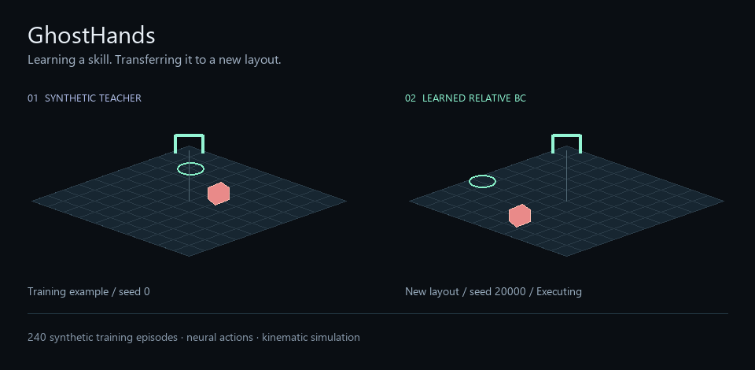
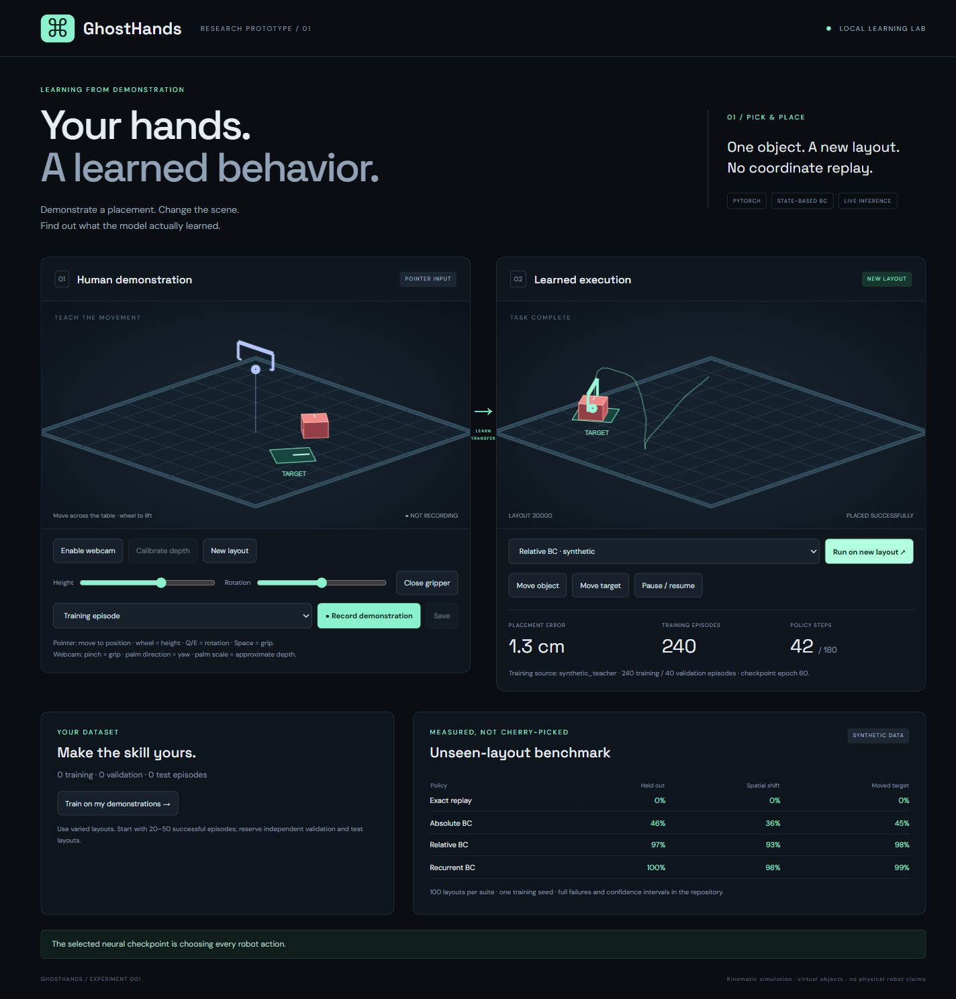
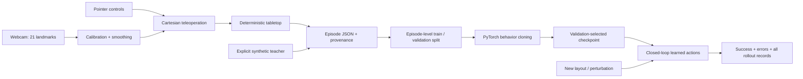
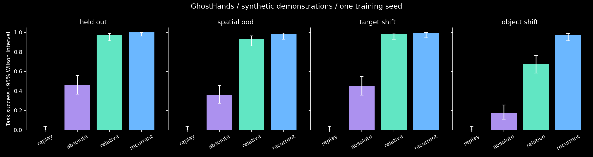

# GhostHands

### Demonstrate a placement. Change the scene. Test what the agent learned.

An imitation-learning research prototype with webcam teleoperation, learned Cartesian
gripper policies, and an auditable generalization benchmark.



**Status:** working MVP, trained and evaluated in a lightweight kinematic simulator.
The animation and included checkpoints use **synthetic teacher demonstrations**, not
human webcam data. Human recording and human-only training are implemented; live webcam
quality and human-trained generalization have not yet been validated with a participant.

## What it does

Control a virtual gripper with your hand or pointer, record complete pick/rotate/place
episodes, train a PyTorch policy, and run it in a different layout. The robot side chooses
each action from its learned checkpoint and the current scene. There is no scripted
fallback. Move the target or object during execution to test recovery.

The interesting question is whether imitation transfers a goal-conditioned skill across
layouts. Success here does **not** establish human-like intent understanding, visual
reasoning, or physical robot competence.

## Quick start

From the repository root, using Python 3.11 or later:

```sh
python -m venv .venv
# Windows PowerShell:
.venv\Scripts\Activate.ps1
# macOS/Linux instead: source .venv/bin/activate
python -m pip install -e ".[dev]"
ghosthands serve
```

Open **http://127.0.0.1:8765**. Included small checkpoints in `assets/` let you run
immediately without training. The server binds only to loopback and is intended for one
local user. Launch from the repository root so data/checkpoint paths resolve correctly.
The core demo works without a GPU. Browser hand tracking downloads MediaPipe assets;
pointer control and the included policy do not need a camera.

## A ten-second tour

1. Select **Relative BC · synthetic** or **Recurrent BC · synthetic**.
2. Click **Run on new layout**. Watch the gripper pick up, align and release the block.
3. During another run, click **Move target** or **Move object**.
4. Compare with the benchmark below; one attractive rollout is not the evaluation.

The left panel is live teleoperation; its trail appears faintly on the robot panel for
comparison. It is an absolute trajectory overlay, not model attention or a robot plan.
The UI shows true rollout error, checkpoint provenance, episode count and success/failure.



## Architecture



The simulator implements xyz translation, yaw, binary closure, simple gravity and a
proximity/orientation attachment constraint. The gripper is kinematic. Contact forces,
friction, robot arm inverse kinematics and obstacle collisions are outside this MVP.
Objects and targets are virtual and their state is known exactly. This isolates policy
generalization from perception errors, but also makes the task easier than real robotics.

See [architecture decisions and research sources](docs/architecture.md), including
the comparison of MuJoCo, PyBullet, ManiSkill, Isaac and the custom environment.

## Human demonstration pipeline

Enable the webcam, hold an open palm comfortably, and choose **Calibrate depth**.
Palm location controls xy; palm scale provides an approximate depth control; palm direction
controls yaw; a palm-normalized thumb/index distance with hysteresis controls closure.
This is teleoperation for collecting labels, not the learned robot policy.

Record an episode, approach the cube, align the gripper with the cube's direction mark,
lower, pinch to grasp, lift, move to the target, align with its direction mark, lower,
then release. Wait briefly for stable placement and save. **New layout** resets the task.
Select training/validation/test before recording. Do not reuse a layout across splits.

Pointer fallback: move over the tabletop to control xy, wheel or slider for height,
Q/E or slider for yaw, and Space or the gripper button for closure. Keyboard shortcuts
apply when focus is outside a form control. Recording resets the scene to its initial state.

Raw webcam pixels stay in the browser. Saved data contains state/action sequences and,
for webcam episodes, normalized landmarks. Tracking loss pauses commands; recalibrate
when camera distance changes. Depth is a control proxy, not metric 3D reconstruction.

## Models

| Policy | Input | Architecture | Purpose |
|---|---|---|---|
| Exact replay | One fixed training action sequence | No learning | Coordinate-replay baseline |
| Absolute BC | Raw poses, grip/contact | MLP 14→128→128→5 | Layout-dependent baseline |
| Relative BC | Relative geometry + heights + grip/contact | Same MLP | Translation-aware representation |
| Recurrent BC | 8 relative observations | GRU(96) → MLP head | Temporal context |

Motion outputs use tanh and MSE; closure uses a logit and binary cross entropy.
The GRU re-encodes a sliding eight-frame history, rather than carrying hidden state
indefinitely. Every policy is queried after each environment step. ACT-style chunks,
diffusion policies and image encoders are deferred; this implementation is not called ACT.

The 14-scalar observation and five-scalar action contracts are documented in
[dataset.md](docs/dataset.md). Relative xy features are translation invariant; absolute
height is retained because gravity and the table matter. Yaw uses relative sine/cosine.
No teacher phase labels enter a policy.

## Reproduce training and evaluation

```sh
ghosthands generate
ghosthands train --model all --epochs 60 --seed 42
ghosthands evaluate --count 100
python -m pytest -q
```

These commands generate 240 training and 40 validation episodes, train three models,
and evaluate four policies on 100 paired layouts in each of four suites: 1,600 rollouts.
On restricted Windows environments, give pytest a fresh writable scratch directory:
create `work/` first, then use `python -m pytest -q --basetemp work/test-run`.

Training uses AdamW, gradient clipping, deterministic PyTorch algorithms, fixed seeds
and two CPU threads. Checkpoint selection uses only validation action loss. JSON training
logs contain every epoch; checkpoints include dataset fingerprints and source metadata.
See [the recorded protocol](configs/benchmark.json) and [tested versions](requirements-tested.txt).
Exact numerical equality across hardware/library versions is not promised.

## Results

Actual CPU run, seed 42, 60 epochs, 240 synthetic training episodes. Each cell is task
success over 100 layout seeds; the same layouts are used for every policy.

| Policy | Held-out layouts | Wider spatial range | Moved target | Moved object |
|---|---:|---:|---:|---:|
| Exact replay | 0% | 0% | 0% | 0% |
| Absolute BC | 46% | 36% | 45% | 17% |
| Relative BC | 97% | 93% | 98% | 68% |
| Recurrent BC | 100% | 98% | 99% | 97% |



For held-out relative BC, the 95% Wilson success interval is **91.5–99.0%**; for
recurrent BC it is **96.3–100%**. These quantify finite evaluation layouts, not uncertainty
across retraining seeds. A single training seed is a limitation. The recurrent policy is
larger, so its gains do not isolate temporal context from capacity.

| Policy | Held-out mean placement error, all trials | Successful-path efficiency |
|---|---:|---:|
| Replay | 34.73 cm | — |
| Absolute BC | 17.68 cm | 0.580 |
| Relative BC | 2.14 cm | 0.560 |
| Recurrent BC | 1.23 cm | 0.545 |

Efficiency is a straight-line initial hand→object→target lower bound divided by actual
hand path length, averaged over successes only. It is not an optimal collision-aware
planning ratio. It is omitted after interventions because the original lower bound no
longer represents the changed task. Lower error includes failures; failed trials are never dropped.

Inspect [all 1,600 trial records](assets/rollouts.csv), [summary and checkpoint metadata](assets/results.json),
and [relative-policy training log](assets/relative-training.json).

## Generalization protocol

- Train: seeds 0–239; validation: 10000–10039. xy coordinates in [0.25, 0.75].
- Held out: seeds 20000–20099, same sampling range, new layouts and yaw angles.
- Wider spatial range: seeds 30000–30099, xy in [0.10, 0.90]. This is expanded support;
  not every sampled coordinate lies outside the training range.
- Target shift: seeds 40000–40099, goal relocated at step 25.
- Object shift: seeds 50000–50099, grasp forcibly detached and object relocated at step 25.

Both interventions use deterministic new xy coordinates in [0.15, 0.85]. Each rollout
has 180 steps (nine nominal seconds). Success requires previous grasp, release with the
gripper open, object position error <5.5 cm, yaw error <0.25 rad, maintained for six steps.
The browser samples expanded-range layouts and therefore is not identical to the held-out
in-distribution benchmark. Its initial seed is 20000, used openly in the illustrative GIF.

## Failures and honest limitations

Absolute BC often misses the object or fails alignment in unfamiliar layouts. Relative
BC fails 32/100 object-interruption trials. Recurrent BC still fails three. See per-trial
`failure`, `placement_error` and `yaw_error`; categories are coarse, not causal explanations.

There are no tested distractors, object-size shifts, obstacles, stacking, pixel policies,
real object detection or robot hardware. All cubes have the same size. Human trajectory
diversity, webcam latency, depth ambiguity and perception noise remain unmeasured.
Training is not instant one-shot learning. The initial high benchmark score reflects a
simple environment and consistent synthetic teacher, not a solved robotics problem.

## Train your own policy

Record varied successful episodes and reserve independent validation layouts. The UI's
**Train on my demonstrations** button trains a relative BC model using only successful
human-source episodes. Choose **My demonstrations · human BC** afterward.
The metadata distinguishes this from the synthetic checkpoints.

```sh
ghosthands train --data data/human --source human --model relative --output runs/human
```

Record at least 20–50 examples before interpreting performance; the software minimum
of two training plus one validation episode is only an integration guard. Failed recordings
remain available for inspection but are excluded from human-only BC training. Test episodes
are never consumed by the trainer. To benchmark all human-trained architectures on randomized
simulator layouts, train all models then call evaluation with their directory:

```sh
ghosthands train --data data/human --source human --model all --output runs/human
ghosthands evaluate --data data/human --checkpoints runs/human --output runs/human-evaluation
```

This evaluator tests simulator layouts, not imitation accuracy against the recorded human
test trajectories. Keep those recordings for a future trajectory-fidelity experiment.

## Repository map

```text
assets/                    Trained small checkpoints, GIF, plots, full evaluation and logs
configs/benchmark.json     Recorded experimental settings
docs/                      Architecture rationale and dataset schema
src/ghosthands/
  simulation.py            Dynamics, scoring and representation
  data.py                  Episode validation/storage and synthetic teacher
  models.py                MLP, GRU and learned-only inference
  training.py              Episode-safe windows and validation-selected training
  evaluation.py            Paired seeded rollouts and confidence intervals
  server.py                Local recording, training and rollout API
  ui/                      Browser interface and MediaPipe teleoperation
  cli.py                   Reproducible commands
scripts/render_demo.py     GIF generated from actual simulation trajectories
tests/                     Transforms, dynamics, splits, training/checkpoints and API
```

## Milestones and next experiments

Architecture, simulation, synthetic data/baselines, learned training, generalization
evaluation and the interactive UI are implemented. The demo animation and experiment
records are included. Human collection is implemented but awaits real participant data.

Next: validate hand calibration with real users; run human-only learning curves at
10/25/50/100 demonstrations; repeat training with at least three seeds; test noisy state
and new sizes; migrate the exact task to MuJoCo contacts; then consider action chunking.
Only add stacking after these results support the current pick-and-place claim.

Git milestones preserve the architecture, learning pipeline, interface and measured results.
No datasets, webcam recordings, credentials or `.env` files are tracked. The checked-in
model weights are small, synthetic-trained project artifacts. The initial GitHub repository
is private so its owner can review the prototype before publishing a portfolio claim.
